# NPSR1 interface and interaction with NPS

Giacomo Castagnetti, Marianna Gordin, Sara Petrini and Anna Salvadori

## Abstract

The neuropeptide S receptor (NPSR1, human) [1] is a G-protein coupled receptor and it is an integral membrane protein. Neuropeptide S (NPS) [2] is the endogenous ligand of NPSR1. The purpose of this study is to analyze the structure of the receptor and to understand its interaction with NPS. To investigate these aspects, Python scripts were implemented to retrieve general information about the amino acid composition and the solvent-accessible surface area; ChimeraX was used to analyze the tridimensional structure of the receptor and its surface of interaction with the neuropeptide; docking webapps were used to study the interaction with NPS. To further improve the reliability of the docking analysis, a comparison with the oxytocin receptor was performed. Our study allowed us to understand how the receptor interacts with its ligand and to visualize their interaction, also with respect to relevant mutations of NPSR1. 

Keywords: NPSR1, NPS, interaction, interface.

## 1. Introduction

NPSR1, short for Neuropeptide S receptor, is a G protein-coupled receptor mainly found in the brain. NPSR1 and its associated ligand NPS, a neuropeptide of about 20 amino acids [3], play an essential role in many physiological and behaviour processes, including anxiety and stress responses, arousal and wakefulness, and emotional and sensory processing [4].
Given its role in many important processes, structural studies are fundamental for a better understanding of its function and its potential for pharmacological intervention. Due to the challenges in the crystallisation process of GPCRs, its structure has not been studied much yet. The available studies on the structural relationship between NPSR1 and NPS have highlighted pathogenic mutations: N107I is involved in asthma pathogenesis [5]; Y206H leads to a decreased need for sleep causing side effects such as memory deficit [6].
The aim of this study is to analyse the structure of the receptor, focusing on the interface with NPS, in order to better understand the effects of mutations.

## 2. Materials and Methods

### 2.1 AlphaFold

AlphaFold is an artificial intelligence program developed by DeepMind, a subsidiary of Alphabet, which performs predictions of protein structures. The structure of NPSR1 and NPS were retrieved from AlphaFold database [7]. We chose the NPSR1 AlphaFold structure over the SwissModel [8] one because, in SwissModel, the protein lacks two terminal regions (from amino acid 1 to 50 and from amino acid 346 to 371). In order to get consistent results with the analysis performed on the sequence of the protein and on its annotation, we preferred to stick with the AlphaFold model, even though the terminal regions have low prediction accuracy.
Furthermore, the structure of NPSR1 present on SwissModel was built starting from the Crystal structure of the human oxytocin receptor, which has 29.59% identity with NPSR1. The crystal structure of oxytocin presents a lot of missing regions, therefore using it for homology modelling does not allow to have a complete and accurate predicted model. We exploited the crystal structure of the Oxytocin receptor, bound with oxytocin and its G-protein, to compare our predicted binding site for NPS with the binding site for Oxytocin.
The NPS model present in Alphafold is 89 amino acids long. Despite recent papers describe NPS as a 20 aa long peptide [9] , we still analysed the 89 amino amino acid model, since it is reported in the official databases. The AlphaFold structure of NPS has a low general pLDDT score as peptide structure prediction is quite challenging. Nevertheless, AlphaFold is still the best choice when lacking an experimental structure [10].

### 2.2 Python

#### Amino acid composition

Different Python scripts for retrieving the amino acid relative abundance were implemented: using the FASTA file to obtain the general distribution of the amino acids in the protein (functionsFASTA.py); using the GFF file to retrieve the transmembrane domain’s sequence in order to compute amino acid distribution in the domain (functionsGFF.py). In all the analysis the relative abundance was computed as: (aa / TOT) * 100, where: aa is the abundance of the amino acid, and TOT is the total number of amino acids of the considered segment (whole protein, TM domain). 
The FASTA and GFF files used in these analyses were downloaded from UniProt, a resource for protein sequence and functional information [11].

#### SASA

A Python script (SASA.py) for retrieving the solvent-accessible surface area (SASA) was implemented. The analysis works by inspecting a DSSP file, retrieved from the PDB file of the considered protein or peptide through the DSSP program (see paragraph of DSSP). The script gives as results the total SASA, the SASA of the transmembrane domain of the receptor, which was obtained through the analysis of NPSR1 with ChimeraX, and the SASA of the interface, computed from the area of the receptor and the neuropeptide in their monomeric and in their complex form. 
Another analysis performed with SASA was to predict which residues of NPSR1 are most involved in the interaction with NPS, therefore pointing out the most relevant residues composing the interface. The analysis has been performed starting from the docking model, considering the residues that had a change in accessibility between monomeric and complex forms higher than a specific threshold, specifically 50 Å2.

### 2.3 DSSP

The DSSP program [12,13] computes the most likely secondary structure given the tridimensional structure of a protein, by extracting information from the 3D coordinates. Moreover, a web server [14] is provided to obtain individual DSSP files for private PDB files. In this study, the web server was used to convert the PDB files of NPS, NPSR1 and the docking model to DSSP files. The output from DSSP contains secondary structure assignments, and many other information, one line per residue; among these additional information we used residue number, one letter amino acid code, and accessibility (residue water exposed surface in Å2).

### 2.4 ISPRED4

ISPRED4 is a web-server for predicting protein-protein interaction sites starting from protein structure [15]. We uploaded AlphaFold's PDB file to the website and ran the algorithm with default RSA (≥ 0.20) and PDB chain “A”.

### 2.5 PDB

The Protein Data Bank (PDB) [16] is a database of 3D structure data for large biological molecules (proteins, DNA, and RNA). A PDB file is a text file consisting of many lines called records, which can be of different types. The ATOM records describe the coordinates of the atoms that are part of the protein; these records contain several columns, among which atom name, residue name, chain identifier, residue sequence number, X, Y and Z orthogonal coordinates, occupancy, and temperature factor.

### 2.6 ChimeraX

UCSF ChimeraX [17] is a next-generation molecular visualisation and analysis program developed with the support of National Institutes of Health (NIH). We used ChimeraX to generate images that could support and visualise our results, and to perform the structural analysis of the NPSR1 AlphaFold model.

### 2.7 ClusPro

ClusPro [18,19,20] is a fully automated, web-based program for the computational docking of protein structures. It allows to predict the most likely 3D configuration of two proteins that interact together. The docking run was performed with default options and run on the CPU server of ClusPro.

## 3. Results

### 3.1 Analysis of amino acid composition

The general amino acid composition of the whole receptor is shown in Figure 1a. From this analysis, it is possible to see that non-polar amino acids are the most present, which makes sense since the protein is embedded in the membrane. Specifically, the most common amino acid is isoleucine (I) with a relative abundance of 10.24% (Table S1), followed by serine (S) with a relative abundance of 9.97%. On the other hand, not considering the nonstandard amino acids which are not present in the protein, the less present amino acid is histidine (H) with a relative abundance of 0.54%. 
A clearer view of the composition by property can be seen in the Figure 1b. This histogram shows that non-polar amino acids are the most common in the protein with a relative abundance of 40.7% (Table S1), followed by polar amino acids with 26.95% (Table S2). 

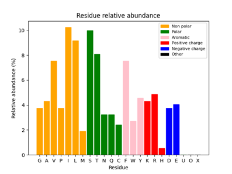
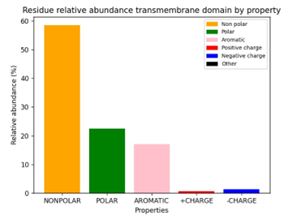

Figure 1. Amino acid composition of the protein (a) and grouped by property (b).

### 3.2 Structural analysis

NPSR1 is a single-chain G-protein coupled receptor (Figure 2a), whose sequence counts 371 amino acids. The structure is composed of 7 transmembrane helices (amino acids 28-75, 82-111, 118-151, 153-182, 204-250, 267-298, and 306-337, respectively), and two disordered topological domains, whose presence determines the subcellular localization of the protein. In fact, only isoforms with the 7 transmembrane topology (isoforms 1, 3, and 4, out of 9) are transported into the plasma membrane to become multi-pass membrane proteins, while the truncated ones remain in the cytoplasm. The helices form a cylindrical structure with a deep ligand-binding site at its center. 
Unfortunately, the AlphaFold prediction for these unstructured regions has very low confidence.

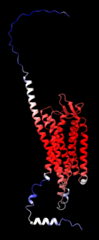
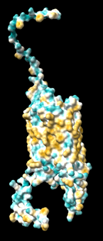

Figure 2. 3-dimensional structure of NPSR1 from the AlphaFold model (a) and its hydrophobicity surface pattern (b).

Applying a coloring scheme to the surface structure of a protein helps in the identification of interaction sites for nonpolar or transmembrane molecules. It is particularly useful for NPSR1, as it is predominantly non-polar (Figure 1b). 
The default lipophilicity coloring scheme ranges from dark cyan for the most hydrophilic to dark goldenrod for the most hydrophobic residues. In the case of NPSR1, for example, we can discern a clear hydrophobic region around the central portion of the protein. The parts exposed to the matrix or the cytosol and the ones interacting with the polar heads of phospholipids are the hydrophilic regions of the protein. The parts in contact with the phospholipid tails, instead, are hydrophobic. In other words, the protein has hydrophobic residues on the surface contacting the plasma membrane and at the core, while it has polar residues on the disordered domains that stretch out from the embedded region and in the interior of the binding pocket (Figure 5c). 
From the analysis of the solvent-accessible surface area (SASA), it resulted that the receptor has an accessible area of 27089.0 Å2.

### 3.3 Amino acid composition of the TM domain

The amino acid composition of the transmembrane domain is depicted in Figure 3a. From here it is possible to see clearly that the domain is mainly composed of non-polar amino acids. Since the domain under analysis is the part of a protein embedded in the membrane, it is expected that most amino acids are non-polar, while polar and aromatic amino acids are found buried inside the protein. 
The composition of the transmembrane domain, as compared to the whole protein (Figure 3c), shows a different residue distribution. 
Specifically, the transmembrane domain has a significant increase of non-polar amino acids with a delta relative abundance of 17.8% (Table S4). On the other hand, charged amino acids show a big decrease (9.02% for positively charged amino acids, and 6.46% for negatively charged amino acids, Table S4).
Considering only the transmembrane domain residues obtained with ChimeraX, the total accessible area of the transmembrane domain is 5417.0 Å2.

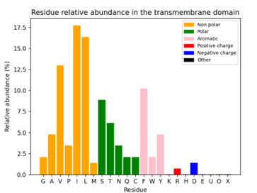
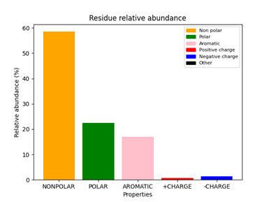
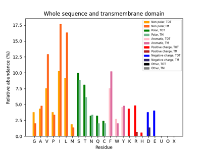
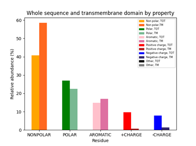

Figure 3. Amino acid composition of the transmembrane domain for each amino acid (a) and collapsed by property (b). The composition is then compared to the whole protein for each amino acid (c) and collapsed by property (d). 

### 3.4 Interface prediction

#### ISPRED4 prediction
The first approach that we employed to predict the protein’s interface was ISPRED4. The results are shown in Figure S1. 
The disordered domains are both classified as interface, which makes sense since they are part of the interaction with NPS and the subsequent signaling pathway. On the other hand, the transmembrane domain (the central part) is classified as a mixture of surface and interface. However, given that the domain is membrane embedded, it doesn’t make sense to have residues classified as interface there. For this reason, we have not considered the result of ISPRED4 as relevant for the subsequent analysis.

#### Docking

The second approach that we employed to predict the interface of NPSR1 with NPS was to directly model their behaviour in interaction. This can be done thanks to docking algorithms that take two separated proteins (NPSR1 and NPS) and calculate what is the best configuration of interaction between them. The predicted structure of NPS (Figure S2) is constituted by an alpha helix, followed by a small alpha helix hairpin and an unstructured region. The solvent-accessible surface area of NPS is 10754.0 Å2.
The docking output generated by ClusPro consisted of 30 3D models of NPSR1 and NPS in interaction. We manually analysed each model to find the ones that are more consistent with the results that were presented up to now.
As we already said, NPSR1 is a membrane embedded receptor that has a transmembrane domain, therefore all the docking models that predicted the interaction of the neurotransmitter with the transmembrane helices of NPSR1 were excluded from the analysis.
Only a few models produced by ClusPro had the neurotransmitter bound on one of the two exposed sides of the receptor. In the subsequent paragraphs, we present the best docking model that was produced and evidence supporting its accuracy.

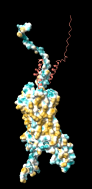
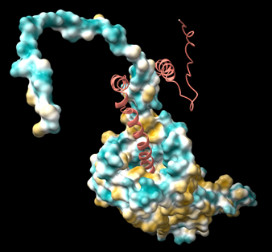
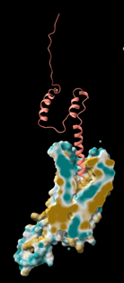

Figure 5. Predicted docking model between NPSR1 and NPS. Frontal view (a), view from above (b) and internal view of the binding pocket (c).

Figure 5 shows the result of the docking algorithm. Neuropeptide S is represented in red while interacting with the receptor (blue and yellow). There are two main areas of contact between the neuropeptide and the receptor: one involves the terminal portions of the proteins, away from the core of the dimer, while the other is a deep binding pocket in the core of the receptor.
The final part of NPS, constituted by the alpha helix hairpin and the unstructured region, is interacting with the initial unstructured region of the receptor and with part of its first alpha helix. The initial part of NPS, constituted by an alpha helix, penetrates deep into the transmembrane helices of the receptor, reaching the binding pocket embedded in the protein. Assuming that the ligand is binding the receptor from the extra membrane side, the model is highly consistent with the mechanism of G protein-coupled receptors, since they bind the ligand outside of the cell in a deep binding pocket. Figure 5c is the cross section of the binding pocket. From this view we can appreciate how deep NPS is penetrating in the receptor, and we can have an idea of the hydrophobicity pattern of the binding pocket. Despite being a core region of the receptor, embedded in the membrane, it is characterized by hydrophilic areas that allow the interaction with NPS.
Thanks to this docking model, we can also speculate that the two terminal unstructured portions of the proteins could have a role in recruitment, interaction, or stabilization of the complex. Unfortunately, the low prediction score of these regions does not allow us to produce reliable functional statements; furthermore, if these regions have a dynamic behavior, it would be very difficult to understand their role even if we had the experimental structure.

#### Comparison with oxytocin

In order to provide evidence in support of the predicted model, we decided to carry out a comparison analysis with the crystal structure of the oxytocin receptor.

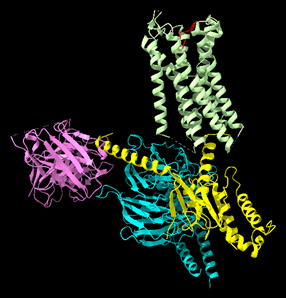
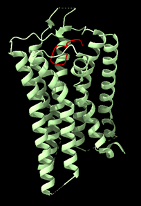

Figure 6. (a) PDB x-ray crystallography structure of Oxytocin receptor (green) with oxytocin (red), G-protein (yellow and cyan) and an antibody (purple). (b) Isolated Oxytocin receptor (green) with its ligand (red).

Oxytocin receptor has 30% of sequence identity with NPSR1 and it was crystallized together with its G-protein and its ligand.
Figure 6 shows the experimental structure determined from an X-ray diffraction experiment of the oxytocin receptor. 
In Figure 6b is shown a close up of the receptor. The lower side of the receptor faces the inside of the cell, while the upper part is the extracellular domain. The terminal parts of the protein, as well as many loops, are missing from the crystal.

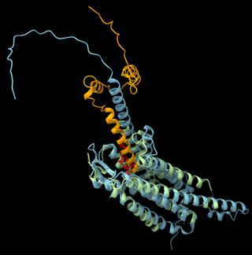
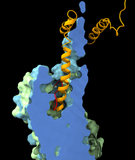
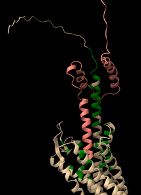

Figure 7. Superimposition between NPSR1-NPS docking model (respectively cyan and orange) and oxytocin receptor bound with oxytocin (respectively green and red). Total view (a) and clipped view of the binding pocket (b). (c) Docking model with contacts between NPSR1 (beige) and NPS (red) highlighted in green. The white arrow indicates a region of the disordered tail that likely has functional importance.  

By superimposing the two structures (Figure 7a), we can clearly appreciate the similarities between the two receptors. All the transmembrane helices present in the extracellular domain are conserved in both receptors. The AlphaFold structure is provided with all the loops and terminal portions that are lacking from the experimental structure; these portions are also the ones associated with the lowest pLDDT score. The striking result coming from this superimposition is that NPS and Oxytocin are binding their respective receptors in a very similar way. As you can see from Figure 7b, both ligands are inserted in a binding pocket that is conserved between the two receptors. This means that the docking algorithm has correctly predicted the binding pocket of NPSR1 and that the interaction between NPS and NPSR1 is consistent with the behavior of similar receptors.

### 3.5 Interface analysis

In Figure 7c, residues of NPSR1 colored in green are the ones determining the interaction with NPS (red). Even though the prediction of the structure has low confidence, we can speculate that the disordered tail (signaled by a white arrow in Figure 7c) of NPSR1 is functionally important. In fact, some of its residues are involved in the formation of the contacts with NPS, and could provide sites for protein recognition, ligand binding and membrane interaction.
From the docking model, we computed the surface of interaction, given the SASA values for NPS and NPSR1 in their monomeric and complex forms. This area is 3561.5 Å2.
The analysis of the docking model also provides a prediction of the residues with highest involvement in the interaction between NPS and NPSR1, therefore indicating that the most relevant residues composing the interface are: V24, C26, T27, E28, T29, T31, F32, E34, V35, K39, W41, Y45, W198, D253, Y290, F309, Q316, R356. 

## 4. Discussion

The results presented in this report provide information on structure-function relationships between NPSR1 and its ligand. Changing a single amino acid, especially if it is positioned within a conserved region, can deeply affect the function and catalytic activity of a protein; for this reason, we examine here two known NPSR1 missense mutations. 
The Y206H missense mutation in NPSR1 is associated with a naturally occurring short sleep phenotype in humans. In vivo, the mutant receptor shows increased responsiveness to external activation by neuropeptide S, and makes neurons hypersensitive to NPS [6]. A homozygous NPSR1-N107I polymorphism (usually involved in asthma pathogenesis) was reported to be associated with slightly reduced (~20 min) sleep duration by genetic association studies in humans. Similarly to NPSR1-Y206H, NPSR1-N107I is a hyperactive form of NPRS1 [5]. 
Both the Y206 and N107 residues are located on the outer surface of the extracellular domain, suggesting that the two mutations may enhance the affinity of the ligand or the efficacy of the agonist, rather than creating more constitutively active receptor forms. Situated within structural helices and in close structural proximity to crucial residues in the NPS/NPSR1 interface (Figure S3), these residues likely play a role in modulating the interaction with NPS. 
Specifically, the NPSR1-N107I mutation results in an increased potency, unrelated to any change in the affinity of NPS for NPSR. Instead, it appears to stem from a variation in the intrinsic efficacy of NPS, which indicates its ability to activate the receptor once bound [5]. Since NPS/NPSR1 signaling has wake-promoting effects, this implies that the increase in potency derived from the gain-of-function N107I and Y206H mutations is crucial in regulating the duration of human sleep.
While the Y206 residue is highly conserved in all vertebrates, the residue in position 107 is typically Ile in most mammals, except for humans. This makes the first position more susceptible to any minor change and, considering its involvement in the interaction with NPS, could explain why its missense mutation has a higher effect on sleep duration than N107I. 

## 5. Conclusions

Our work is a demonstration of how prediction methods of protein structure and interaction can provide meaningful results. We propose a model of interaction between NPSR1 and NPS that is consistent with evolutionary related receptors and with known disease-related mutations of this protein.
This study has explored the extra membrane interface of NPSR1 and its interaction with NPS. Future studies that employ similar approaches can be focused on the inner side of NPSR1 and on the interaction with its coupled G-protein.

Supplementary Materials: Table S1: Amino acid relative abundance whole protein; Table S2: Amino acid relative abundance whole protein grouped by property; Table S3: Amino acid relative abundance transmembrane domain; Table S4: Amino acid relative abundance transmembrane domain compared to whole protein; Figure S1: ISPRED4 prediction; Figure S2: NPS AlphaFold predicted structure; Figure S3: Close up of the Y206H and N107I missense mutations (gold) in their respective positions on the NPSR1 structure. The scripts and files are available at the GitHub repository: https://github.com/kcajj/NPSR1.

Author Contributions: Python scripts, Sara Petrini and Anna Salvadori; amino acid composition, Sara Petrini; SASA, Anna Salvadori; ISPRED4, Sara Petrini; docking, Giacomo Castagnetti; ChimeraX, Marianna Gordin; structural and mutation analysis, Marianna Gordin.

# Citations

1. Reinscheid RK, Ruzza C. Pharmacology, Physiology and Genetics of the Neuropeptide S System. Pharmaceuticals (Basel). 2021;14(5):401.
2. Okamura N, Reinscheid RK. Neuropeptide S: a novel modulator of stress and arousal. Stress. 2007;10(3):221-6.
3. R.K. Reinscheid. Encyclopaedia of Neuroscience, 1st; Academic Press:University of California at Irvine, CA, USA,  209; pp. 817-819.
4. Zhang Y, Wang Z, et al. Novel neuropeptides as ligands of orphan G protein-coupled receptors. Curr Pharm Des. 2011;17(25):2626-2631.
5. Bernier V, Stocco R, Bogusky MJ, et al. Structure-function relationships in the neuropeptide S receptor: molecular consequences of the asthma-associated mutation N107I. J Biol Chem. 2006;281(34):24704-24712. 
6. Xing L, Shi G, Mostovoy Y, et al. Mutant neuropeptide S receptor reduces sleep duration with preserved memory consolidation. Sci Transl Med. 2019;11(514):eaax2014.
7. AlphaFold. Available online: https://alphafold.ebi.ac.uk/ (accessed on 17th Dec 2023)
8. SwissModel. Available online: https://swissmodel.expasy.org/ (accessed on 17th Dec 2023)
9. Ruzza C, Calò G, Di Maro S, et al. Neuropeptide S receptor ligands: a patent review (2005-2016). Expert Opin Ther Pat. 2017;27(3):347-362.
10. McDonald EF, Jones T, Plate L, Meiler J, Gulsevin A. Benchmarking AlphaFold2 on peptide structure prediction. Structure. 2023;31(1):111-119.e2.
11. UniProt. Available on: https://www.uniprot.org/ (accessed on 20th Dec 2023)
12. Joosten RP, te Beek TA, Krieger E, et al. A series of PDB related databases for everyday needs. Nucleic Acids Res. 2011;39(Database issue):D411-D419.
13. Kabsch W, Sander C. Dictionary of protein secondary structure: pattern recognition of hydrogen-bonded and geometrical features. Biopolymers. 1983;22(12):2577-2637.
14. DSSP. Available online: http://www.cmbi.umcn.nl/xssp/ (accessed on 27th Dec 2023, 3rd Jan 2023)
15. ISPRED4. Available online: https://ispred4.biocomp.unibo.it (Accessed on 19th Dec 2023)
16. PDB. Available online: https://www.rcsb.org/ 
17. Meng EC, Goddard TD, Pettersen EF, et al. UCSF ChimeraX: Tools for structure building and analysis. Protein Sci. 2023;32(11):e4792.
18. ClusPro. Available online: https://cluspro.bu.edu/home.php (Accessed on 27th Dec 2023)
19. Kozakov D, Hall DR, Xia B, et al. The ClusPro web server for protein-protein docking. Nat Protoc. 2017;12(2):255-278. 
20. Kozakov D, Beglov D, Bohnuud T, et al. How good is automated protein docking?. Proteins. 2013;81(12):2159-2166. 